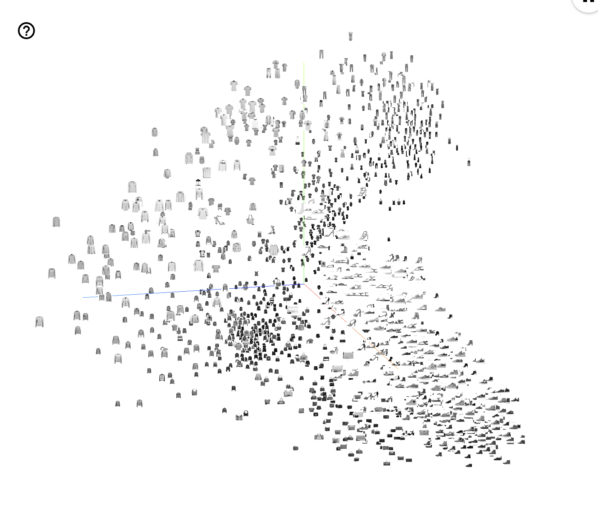

# Embedding Projector

This Notebook is using the Tensorboard to vizualize text & image embeddings from a Transformer model. 

# Example: 

This results was obtained with the DAshion MNIST dataset using 3 components PCA: 

